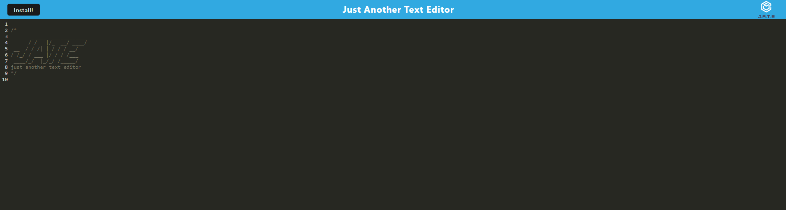
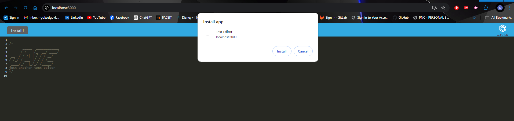
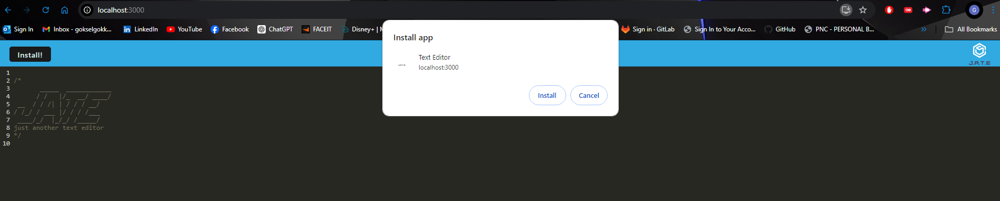
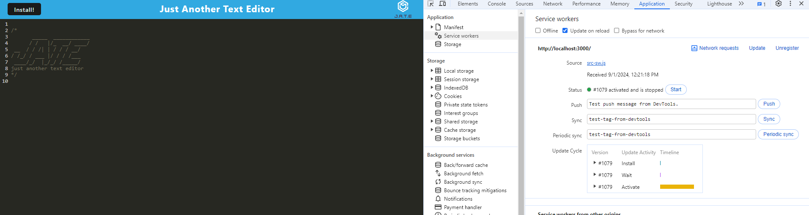
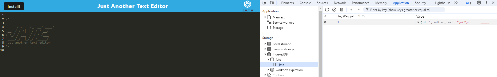

Title: Text-Editor-Again

Description:
In this challenge, I have created a text editor application. I've set up the manifest and service workers to ensure your text editor functions as a Progressive Web App, which allows users to use it offline and even install it on their devices.
How to Run:
Please click on deployed link below and you will be prompted to the main page of the application. You can either use the website version to edit text or you can click on the install button to download and install the application on your desktop.

Github Repository : https://github.com/minikozort/Text-Editor-Again.git
Deployed Link : https://text-editor-again.onrender.com/